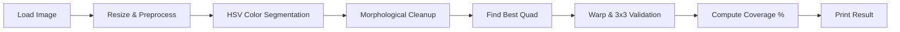

# Marker Coverage Estimator

## 1. Problem Overview & Algorithm 

This C++ console application detects a **Sodyo marker** — a 3×3 grid of colored patches (red, green, yellow, pink, magenta, cyan) — in an input image, and calculates its coverage percentage over the image area.  
The algorithm:
1. **Preprocessing** – Resize to ≤640×480, bilateral filtering, white balance, adaptive gamma, CLAHE ,white Background Removing.
2. **Color segmentation** – HSV thresholding for the 6 colors, morphological cleaning, small-blob removal.
3. **Quad detection** – Find best polygon candidate, robust to ±45° rotation, perspective tilt, moderate blur, and color shifts.
4. **Content validation** – Warp to 3×3 grid and check for ≥5 distinct colors.
5. **Coverage computation** – Polygon area / image area (%).  
Debug mode prints detailed logs and optional OpenCV visualization. Unit tests generate synthetic markers with transformations and noise.

## 2) Build 

From the repo root (same folder as `CMakeLists.txt`, `README.md`, `LICENSE`):

```bash
git clone https://github.com/Harry1712/marker-coverage-Harry-Cohen
cd marker-coverage-Harry-Cohen

mkdir build && cd build
cmake -DCMAKE_BUILD_TYPE=Release -DDEBUG_IMGPROC=OFF ..
cmake --build . -j
```

- Set `-DDEBUG_IMGPROC=ON` to compile with OpenCV windows helpers (imshow of steps).  
- Binaries are written to `build/` by default (see `RUNTIME_OUTPUT_DIRECTORY` in CMake).

### Notes by platform 
- **Linux (Ubuntu/Debian)**: `sudo apt install g++ cmake libopencv-dev`
- **macOS** (Homebrew): `brew install opencv cmake`  
  If CMake can’t find OpenCV:  
  `cmake -DOpenCV_DIR=$(brew --prefix opencv)/share/opencv4 ..`
- **Windows (MSVC)**: same commands work in a “Developer Command Prompt”; for multi-config generators, use:  
  `cmake --build . --config Release`

---

## 3. Usage Examples

```bash
# Basic usage
./marker_coverage image1.jpg image2.png

# Debug mode (verbose logs )
DEBUG=1 ./marker_coverage marker_sample.png

# With runtime measurement
TIME=1 ./marker_coverage marker_sample.png
```

Example output:
```
marker_01.png 83%
marker_02.jpg NO_MARKER
marker_invalid.png LOAD_ERROR
```

Exit codes:
- `0` → marker(s) processed successfully
- `1` → no arguments
- `2` (or non-zero) → no marker found in at least one image

---

## 4. Running Unit Tests

Build with testing enabled:
```bash
mkdir build && cd build
cmake .. -DBUILD_TESTING=ON
make -j$(nproc)
ctest --output-on-failure
```

The tests:
- Generate synthetic 3×3 markers
- Apply random perspective/rotation/noise
- Verify detection and coverage robustness

---


## 6. Pipeline Diagram



---

**Author:** `Harry Cohen`  
**License:** MIT  
